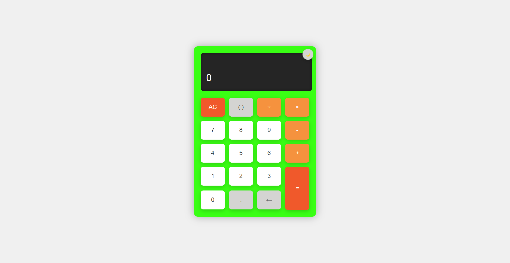
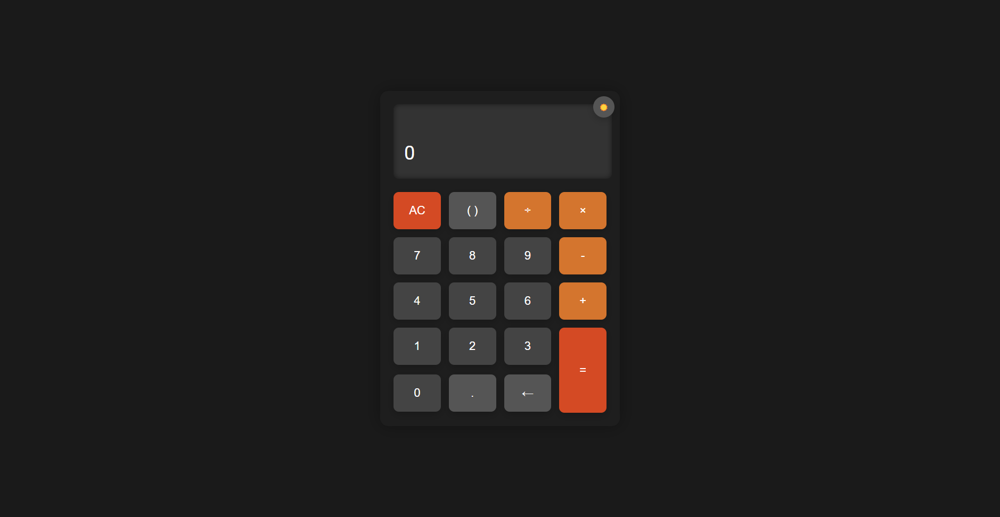

# Calculadora Verde Flúor

  <!-- Si tienes una captura de pantalla, súbela al repositorio y actualiza esta línea -->

Una calculadora web simple y estilizada con un diseño moderno en verde flúor. Este proyecto fue creado como parte de un portafolio para mostrar habilidades en HTML, CSS y JavaScript. Soporta operaciones básicas (suma, resta, multiplicación, división), paréntesis, decimales y funciones como retroceso y limpieza.

## Características

- **Diseño atractivo**: Fondo verde flúor con una pantalla oscura y botones interactivos.
- **Operaciones básicas**: Suma, resta, multiplicación y división.
- **Paréntesis**: Soporte para expresiones con paréntesis (por ejemplo, `(2 + 3) * 4`).
- **Funcionalidad adicional**: Botones para decimales, retroceso (borrar el último carácter) y limpieza (AC).
- **Interfaz responsiva**: Se adapta a pantallas más pequeñas (aunque podría mejorarse).
- **Código abierto**: ¡Contribuye y mejora este proyecto!

## Demo

Puedes probar la calculadora en vivo aquí: [Enlace a la demo](#) <!-- Si subes la calculadora a GitHub Pages o a otro hosting, actualiza este enlace -->

## Instalación

Sigue estos pasos para ejecutar la calculadora localmente:

1. **Clona el repositorio**:
   ```bash
   git clone https://github.com/[tu-usuario]/calculadora-verde-fluor.git
